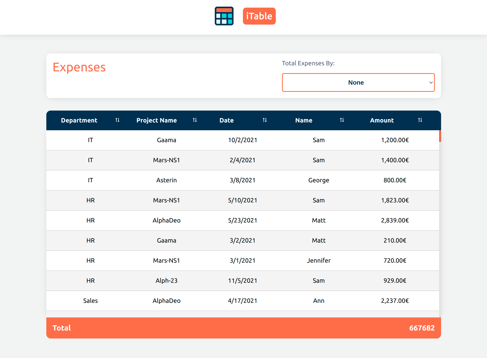
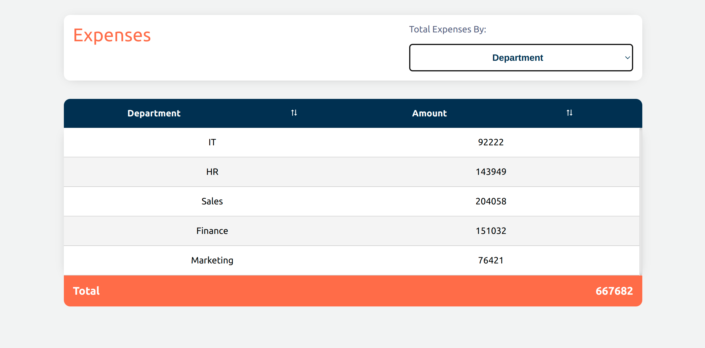
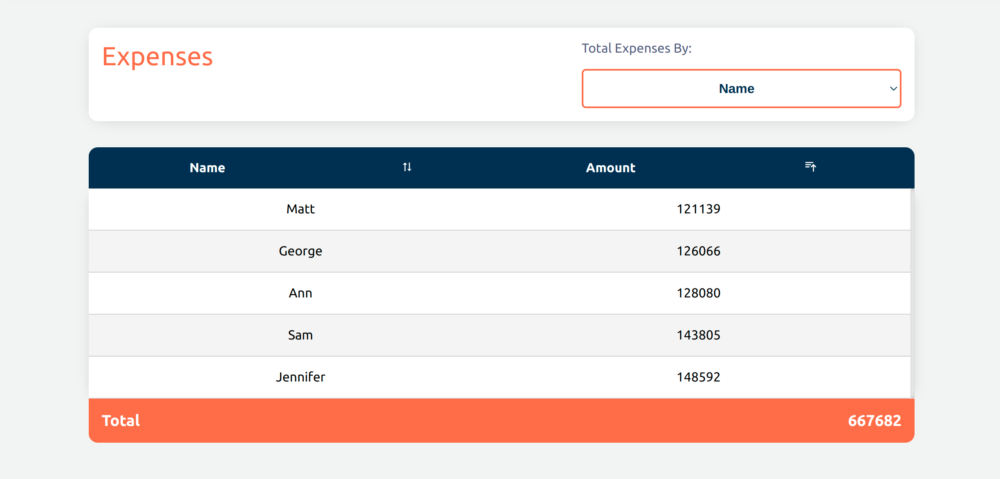

# # iTable [React, Typescript, Styled Components] = ❤️

This project is a simple headless react table component using using custom hook to abstrack table logic and functionalities

## Context

Let's consider Pectus Finance is planning to create a feature to show user uploaded expanses (you can find sample [expanses.csv](https://github.com/Pectus-Finance/hiring-exercises/blob/master/frontend/expanses.csv) file in this repository which you can use as a mock data for your work) data in tabular form and letting user to perform some basic set of operations over data such as sort and filter. You will find more fine-grained details on this under the feature scopes section.

Here is how the table component looks like:


- When previewing full data


- When aggregate expanses by Department


- When aggregate expanses by Name and sort the amount ascending


## Implemented Features

As a user:

- [ ] You can see a expanses data in tabular form.
- [ ] You can perform sort(asc/descending order) operation by clicking on each column header
- [ ] You able to see total sum of expanses by departments, project_name, date and by member_name
- [ ] You able to see total sum of value in amount column

## 📖 Installation

```shell
$ npm install
$ npm start
# Load the site at http://127.0.0.1:3000
```

## 📖 Tech List

- React
- Typescript
- React icons
- React Hooks
- Custom Hooks
- Jest
- Cypress

## Future Features

As a user:

- [ ] You will be able to Paginate your data.
- [ ] You will be able to search and filter data by every columns
- [ ] You will be able to Print Filtered table data
- [ ] You will be able to run action for every row like (add, edit, delete)


## Future Inhancements if I have more time

-  to pass custom render function to render data for every column.
-  To pass custom sorter or comparer function for column sorting.
-  add loading indecator when refetching data.
-  Separate the logic of aggregation and sorting in custom hooks called useAggregateBy and useSortBy
-  Enhance responsiveness
-  Add some unit / E2E tests

## Available Scripts

In the project directory, you can run:

### `npm start`

Runs the app in the development mode.\
Open [http://localhost:3000](http://localhost:3000) to view it in the browser.

The page will reload if you make edits.\
You will also see any lint errors in the console.

### `npm test`

Launches the test runner in the interactive watch mode.\
See the section about [running tests](https://facebook.github.io/create-react-app/docs/running-tests) for more information.

### `npm run build`

Builds the app for production to the `build` folder.\
It correctly bundles React in production mode and optimizes the build for the best performance.

The build is minified and the filenames include the hashes.\
Your app is ready to be deployed!

See the section about [deployment](https://facebook.github.io/create-react-app/docs/deployment) for more information.

## 🤝 Contributing

Contributions, issues and feature requests are welcome!

## ⭐️ Support

Give a ⭐️ if this project helped you!
